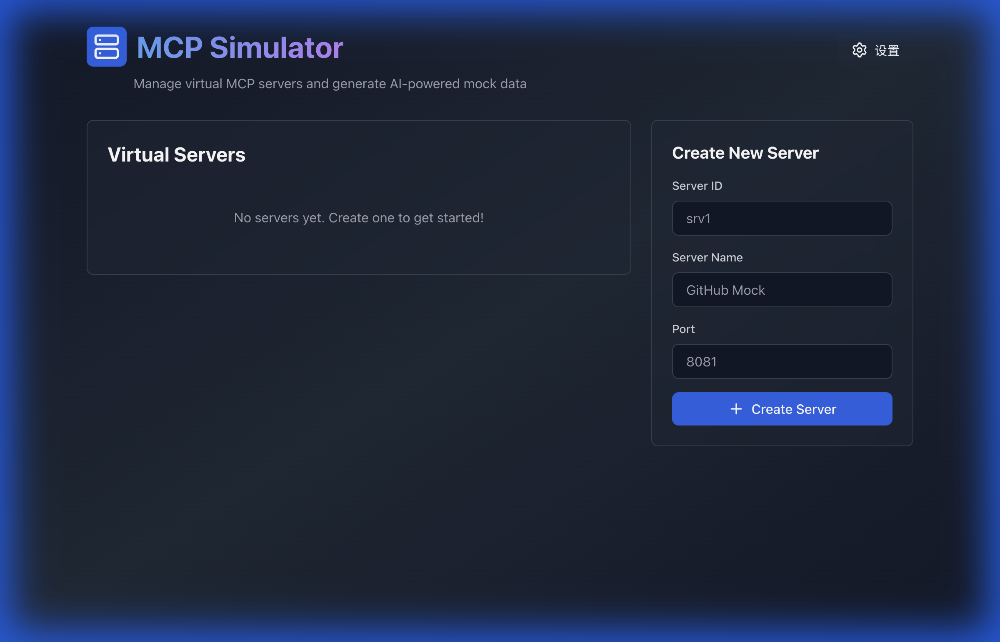
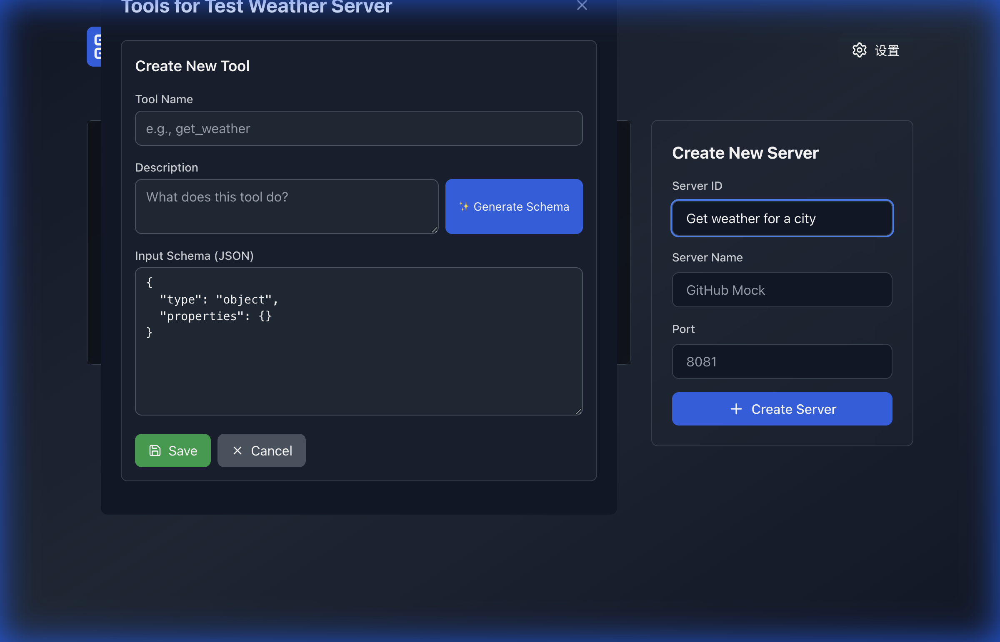
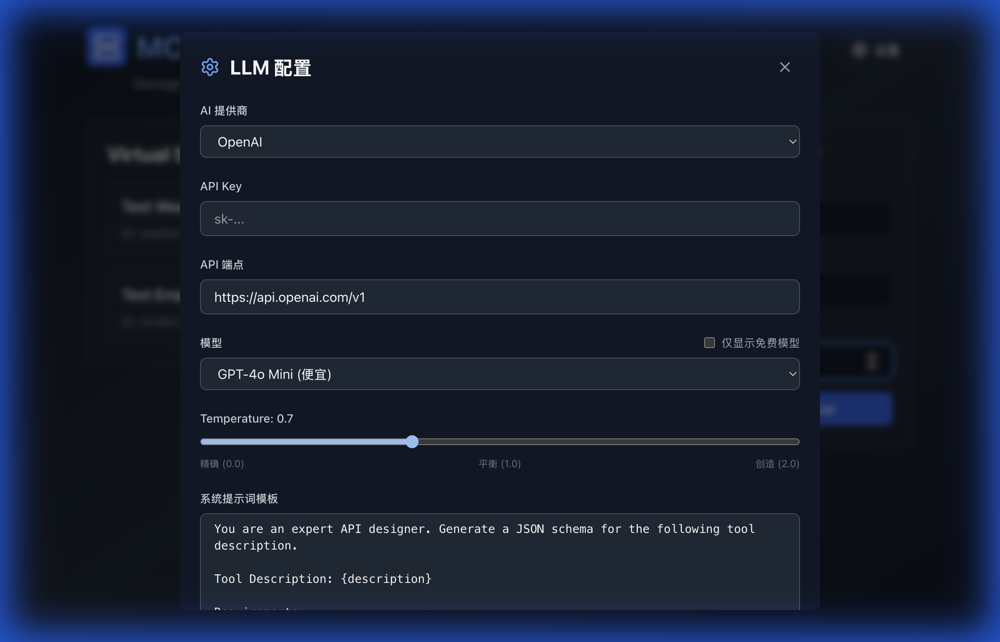

# MCP Simulator 最终用户手册

## 目录

1. [系统简介](#系统简介)
2. [快速开始](#快速开始)
3. [界面操作指南](#界面操作指南)
4. [服务器管理](#服务器管理)
5. [工具配置](#工具配置)
6. [LLM 设置](#llm-设置)
7. [使用场景](#使用场景)
8. [常见问题](#常见问题)

---

## 系统简介

MCP Simulator 是一个用于模拟 MCP (Model Context Protocol) 服务器的测试工具。

### 主要功能

- 🚀 创建多个虚拟 MCP 服务器
- 🔧 为每个服务器定义自定义工具
- 🤖 使用 AI 自动生成工具 Schema 和模拟数据
- 📡 通过 HTTP API 进行测试

### 适用场景

- **MCP 客户端开发**: 在开发 MCP 客户端时，无需真实服务器即可测试
- **API 原型设计**: 快速设计和验证工具接口
- **集成测试**: 为 AI 应用提供可控的 Mock 服务
- **演示和培训**: 展示 MCP 协议的工作方式

---

## 快速开始

### 启动应用

```bash
./mcp-simulator
```

应用将在 `http://localhost:8080` 启动，在浏览器中打开即可使用。

### 5 分钟上手

#### 1. 创建服务器



在右侧表单中填写：
- **Server ID**: `weather-api` (唯一标识)
- **Server Name**: `天气服务` (显示名称)
- **Port**: `9100` (端口号)

点击 **Create Server** 创建。

#### 2. 启动服务器

找到刚创建的服务器，点击 **Start** 按钮，状态变为绿色 "running"。

#### 3. 添加工具

1. 点击服务器卡片上的 **紫色扳手图标** 🔧
2. 点击 **+ Add Tool**
3. 填写：
   - **Tool Name**: `get_weather`
   - **Description**: `获取指定城市的当前天气`
4. 点击 **✨ Generate Schema** 让 AI 生成输入参数
5. 点击 **Save** 保存

#### 4. 测试工具

使用 curl 测试：

```bash
# 生成模拟天气数据
curl -X POST "http://localhost:8080/api/servers/weather-api/tools/get_weather/generate-mock" \
  -H "Content-Type: application/json" \
  -d '{"params": {"city": "北京"}}'
```

---

## 界面操作指南

### 主界面布局

```
┌────────────────────────────────────────────────────┐
│  MCP Simulator                         [设置]      │
├────────────────────────────────────────────────────┤
│  服务器列表              │  创建新服务器           │
│  ┌──────────────┐       │  ┌──────────────────┐  │
│  │ 天气服务     │       │  │ Server ID        │  │
│  │ ● running    │       │  │ Server Name      │  │
│  │ Port: 9100   │       │  │ Port             │  │
│  │ [Start][Stop]│       │  │ [Create Server]  │  │
│  │ [🔧]         │       │  └──────────────────┘  │
│  └──────────────┘       │                         │
└────────────────────────────────────────────────────┘
```

### 状态指示

- 🟢 **running**: 服务器运行中
- 🟡 **starting**: 正在启动
- ⚪ **stopped**: 已停止
- 🔴 **error**: 出错

---

## 服务器管理

### 创建服务器

**必填信息**:

| 字段 | 说明 | 示例 |
|------|------|------|
| Server ID | 唯一标识符，只能包含字母、数字、连字符 | `weather-api`, `calc-v1` |
| Server Name | 显示名称，可以使用中文 | `天气服务`, `计算器` |
| Port | 端口号，范围 1024-65535 | `9100`, `9200` |

**注意事项**:
- Server ID 不能重复
- 端口号不能与已有服务器冲突
- 创建后 ID 和端口不能修改

### 启动和停止

**启动服务器**:
1. 点击服务器卡片上的 **Start** 按钮
2. 等待状态变为 "running" (绿色)
3. 服务器开始在指定端口监听

**停止服务器**:
1. 点击 **Stop** 按钮
2. 状态变为 "stopped" (灰色)
3. 端口被释放

**提示**: 只有 "stopped" 状态的服务器可以启动，只有 "running" 状态的服务器可以停止。

---

## 工具配置

### 打开工具管理器

点击服务器卡片上的 **紫色扳手图标** 🔧。



### 创建工具

#### 方式一：使用 AI 生成 (推荐)

1. 点击 **+ Add Tool**
2. 填写工具名称和描述：
   ```
   Tool Name: get_weather
   Description: 获取指定城市的当前天气，包括温度、湿度、风速等信息
   ```
3. 点击 **✨ Generate Schema**
4. AI 会自动生成输入参数的 JSON Schema
5. 检查生成的 Schema，如需要可以手动调整
6. 点击 **Save** 保存

#### 方式二：手动编写 Schema

1. 点击 **+ Add Tool**
2. 填写工具名称和描述
3. 在 Input Schema 区域手动编写 JSON Schema：

```json
{
  "type": "object",
  "properties": {
    "city": {
      "type": "string",
      "description": "城市名称"
    },
    "units": {
      "type": "string",
      "enum": ["celsius", "fahrenheit"],
      "description": "温度单位"
    }
  },
  "required": ["city"]
}
```

4. 点击 **Save** 保存

### 测试工具 (Test Tool)

#### 快速测试工具功能

使用 **🧪 Test Tool** 功能可以快速生成模拟数据并查看工具行为，无需编写代码。


**操作步骤**:

1. 点击工具旁的 **绿色烧瓶图标** 🧪
2. 在弹出的测试模态框中：
   - **Sample Parameters**: 输入测试参数（JSON格式）
     ```json
     {"city": "深圳"}
     ```
   - **Custom Instructions**: 输入自定义需求（可选）
     ```
     生成5条患者体征监测数据，包括体温、心率、血压、血氧饱和度、尿量
     ```
   - **Model**: 选择使用的AI模型
   - **Temperature**: 调整生成的随机性（0-2）
3. 点击 **🧪 Generate Sample Data**
4. 查看生成的 Mock 数据

**Custom Instructions 示例**:

| 场景 | 自定义指令 |
|------|------------|
| 时间序列数据 | 生成5条体征数据，从2023-10-15 08:00开始，每条间隔4-6小时 |
| 多条记录 | 返回10个患者的基本信息 |
| 特定格式 | 生成JSON数组格式的数据 |
| 真实场景 | 模拟发烧病人的体温数据，范围37.5-39.5℃ |

**优势**:
- ✅ 无需编写 curl 命令
- ✅ 实时查看生成结果
- ✅ 快速验证工具定义
- ✅ 支持自定义数据生成需求

### 编辑和删除工具

- **测试**: 点击 **绿色烧瓶图标** 🧪，快速生成测试数据
- **编辑**: 点击工具旁的 **铅笔图标**，修改后保存
- **删除**: 点击 **垃圾桶图标**，确认删除
- **查看详情**: 点击工具名称旁的 **▼** 展开 Schema

---

## LLM 设置

### 打开设置

点击页面右上角的 **设置** 按钮 ⚙️。



### 选择 AI 提供商

系统支持 13 个 AI 提供商：

#### 国内提供商 🇨🇳

| 提供商 | 特点 | 免费模型 |
|--------|------|----------|
| **SiliconFlow** | 多个免费模型可用 | ✅ Qwen 2.5 7B, DeepSeek V2.5, GLM-4 9B |
| **ModelScope** | 无需 API Key，60+ 模型 | ⚠️ 需查看具体定价 |
| **Kimi** | 月之暗面，长上下文 | ❌ |
| **DeepSeek** | 推理能力强 | ❌ |
| **Zhipu** | 智谱 AI，GLM 系列 | ❌ |
| **MiniMax** | ABAB 系列 | ❌ |
| **Baichuan** | 百川智能 | ❌ |

#### 国际提供商 🌍

| 提供商 | 特点 | 免费模型 |
|--------|------|----------|
| **OpenAI** | GPT 系列，最强大 | ❌ |
| **Anthropic** | Claude 系列，安全性高 | ❌ |
| **Google** | Gemini 系列 | ❌ |
| **OpenRouter** | 聚合多个模型 | ✅ Gemini 2.0 Flash, Llama 3.2 3B |

### 配置步骤

1. **选择提供商**: 从下拉菜单选择
2. **输入 API Key**: 在密码框中输入（部分提供商如 ModelScope 不需要）
3. **选择模型**: 
   - 勾选 "仅显示免费模型" 可以筛选免费选项
   - SiliconFlow 和 ModelScope 支持动态获取最新模型列表
4. **调整 Temperature** (可选):
   - 0.0 = 最精确（适合计算、翻译）
   - 0.7 = 平衡（推荐）
   - 2.0 = 最创造（适合创意写作）
5. **自定义提示词** (可选): 修改系统提示词模板
6. 点击 **保存配置**

### 获取 API Key

- **SiliconFlow**: https://cloud.siliconflow.cn/account/ak
- **OpenAI**: https://platform.openai.com/api-keys
- **Anthropic**: https://console.anthropic.com/
- **其他**: 访问各提供商官网注册获取

---

## 使用场景

### 场景 1: 测试 MCP 客户端

**目标**: 开发一个天气查询的 MCP 客户端

**步骤**:
1. 创建 `weather-server` (端口 9100)
2. 添加工具 `get_weather`, `get_forecast`
3. 启动服务器
4. 在客户端代码中连接到 `http://localhost:9100`
5. 测试工具调用和响应处理

### 场景 2: API 原型设计

**目标**: 设计一个医疗数据查询 API

**步骤**:
1. 创建 `medical-api` 服务器
2. 添加工具：
   - `get_patient_info`: 获取患者基本信息
   - `get_vital_signs`: 获取生命体征记录
   - `get_lab_results`: 获取化验结果
3. 使用 AI 生成每个工具的 Schema
4. 生成模拟数据验证接口设计
5. 与团队分享原型进行讨论

### 场景 3: 集成测试

**目标**: 测试 AI 应用的工具调用逻辑

**步骤**:
1. 创建多个服务器模拟不同的后端服务
2. 配置各种工具和参数
3. 使用 Mock 数据生成功能创建测试数据
4. 在 AI 应用中集成这些虚拟服务器
5. 验证工具调用流程和错误处理

---

### 使用标准 MCP 客户端连接

MCP Simulator 完全兼容标准 MCP 协议。您可以使用任何支持 MCP 的客户端（如 Claude Desktop、Cursor 等）连接到虚拟服务器。

**连接信息**:
- **类型**: SSE (Server-Sent Events)
- **URL**: `http://localhost:{port}/sse` (例如 `http://localhost:9999/sse`)

**功能**:
- 客户端会自动发现所有配置的工具
- 调用工具时，Simulator 会使用 AI 实时生成模拟数据
- 支持查看工具的输入 Schema 和描述

---

## 常见问题 (FAQ)

### Q1: 如何开始使用？

**A**: 
1. 启动应用 `./mcp-simulator`
2. 打开浏览器访问 `http://localhost:8080`
3. 创建第一个服务器
4. 添加工具
5. 开始测试

### Q2: 需要配置 API Key 吗？

**A**: 
- **必须**: 如果要使用 AI 生成 Schema 或 Mock 数据
- **不必须**: 如果只手动创建工具和 Schema
- **推荐**: 使用 SiliconFlow 或 ModelScope 的免费模型

### Q3: 如何生成模拟数据？

**A**: 
```bash
curl -X POST "http://localhost:8080/api/servers/{server-id}/tools/{tool-name}/generate-mock" \
  -H "Content-Type: application/json" \
  -d '{"params": {"city": "北京"}}'
```

前提：已配置 LLM API Key

### Q4: 服务器无法启动？

**A**: 检查：
- 端口是否被其他程序占用
- 端口号是否在有效范围 (1024-65535)
- 是否有足够的系统权限

### Q5: AI 生成的 Schema 不准确？

**A**: 
1. 使工具描述更详细具体
2. 尝试不同的 AI 模型
3. 调整 Temperature 参数
4. 手动修改生成的 Schema

### Q6: 如何测试多个服务器？

**A**: 
1. 创建多个服务器，使用不同端口
2. 全部启动
3. 在客户端代码中连接不同端口
4. 系统会自动管理所有服务器

### Q7: 数据会持久化吗？

**A**: 
是的，系统已支持数据持久化！
- 所有配置保存在 `data/` 目录
- 重启后自动恢复所有服务器、工具和LLM配置
- 数据以 JSON 文件格式存储，方便备份

### Q8: 如何快速测试工具？

**A**: 
1. 在 Tool Manager 中点击工具的 🧪 图标
2. 输入测试参数和自定义指令
3. 点击 "Generate Sample Data" 查看结果
4. 无需编写任何代码！

### Q9: 如何获取帮助？

**A**: 
- 查看本用户手册
- 查看 API 文档（开发者手册）
- 提交 Issue 到项目仓库

### Q9: 系统资源占用？

**A**: 
- 内存: ~50MB
- CPU: 空闲时 <1%
- 网络: 仅调用 LLM API 时产生流量

### Q10: 支持哪些操作系统？

**A**: 
- ✅ macOS
- ✅ Linux
- ✅ Windows
- 需要现代浏览器（Chrome, Firefox, Safari, Edge）

---

## 附录

### 测试录像

完整的系统操作演示: [查看录像](images/comprehensive_system_test.webp)

### 快速参考

**创建服务器**:
```
ID: my-server
Name: 我的服务
Port: 9100
```

**创建工具**:
```
Name: my_tool
Description: 工具功能描述
Schema: (使用 AI 生成或手动编写)
```

**生成 Mock 数据**:
```bash
curl -X POST "http://localhost:8080/api/servers/my-server/tools/my_tool/generate-mock" \
  -H "Content-Type: application/json" \
  -d '{"params": {...}}'
```

---

**版本**: 2.0.0  
**更新日期**: 2025-11-20  
**适用对象**: MCP Simulator 最终用户
**新增功能**: Test Tool UI、数据持久化、自定义Mock数据生成
